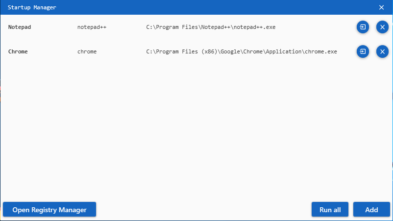
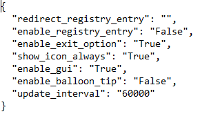
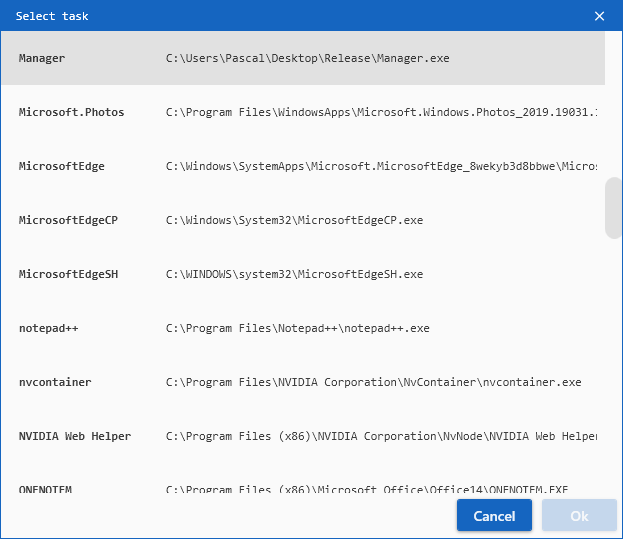

# Startup-Manager
It's a simple program that forces other programs to run, even if they are closed



## Usage
Download and run the latest version:
[Latest version](https://github.com/ProDev2/Startup-Manager/releases/latest)

## Configuration
After starting the program once there will be a config.txt file within the same folder. 
**Changes to this file will be applied on the next program start!**



> The 'update_interval' is set in milliseconds. (1 second = 1000 milliseconds)

> If you disable the exit option you have to force close the program via task manager

## Registry Manager
By using the registry manager within the program you can add the program to the registry of your computer. By doing so the program will start on boot up.

> If you move the program in your file system make sure to start the program once afterwards. This will ensure that the path in the registry is set to the right location.

## Important
It is not recommended to start the program twice. To close it right click the little notification item in your taskbar and hit 'Exit' 
(if that option in't disabled in the 'config.txt' file).

## Adding a program
To add a program to the list hit 'Add' in the bottom right corner of the Startup-Manager's main window. In the following dialog window you can choose a name for the new list entry. After clicking 'Ok' you can choose a process which should be started once in a while. You can also press 'Cancel' and fill in the empty fields ('<empty>') afterwards by clicking on them.

> When choosing a process from the list make sure that the program you're searching for is currently running.



## Details
#License Copyright (C) by Pascal Gerner
```
Licensed under the Apache License, Version 2.0 (the "License");
you may not use this file except in compliance with the License.
You may obtain a copy of the License at

	http://www.apache.org/licenses/LICENSE-2.0

Unless required by applicable law or agreed to in writing, software
distributed under the License is distributed on an "AS IS" BASIS,
WITHOUT WARRANTIES OR CONDITIONS OF ANY KIND, either express or implied.
See the License for the specific language governing permissions and
limitations under the License.
```
